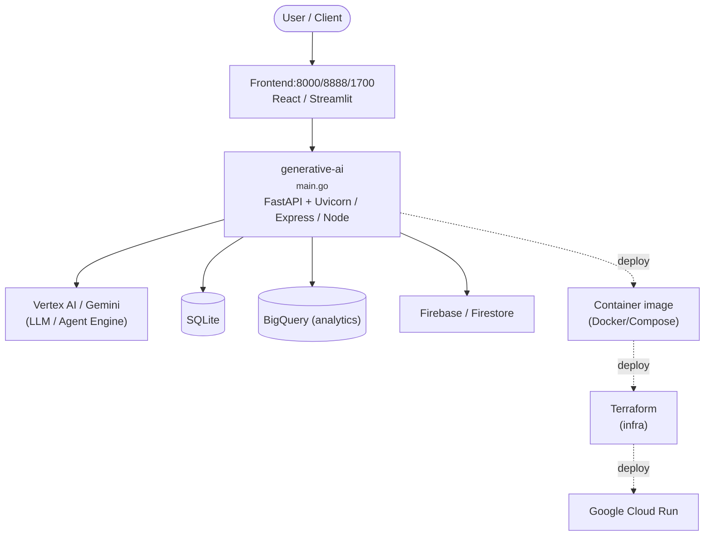

# Context Map — `generative-ai`

> Auto-generated architecture & deployment context map. Summarizes the core application, container/cloud footprint, and database connections. Regenerate after significant structural changes.

**Repo:** `avnit/generative-ai` · **Fork** · Public · Primary language: Jupyter Notebook · Default branch: `main` · Files: 2865

**Description:** Sample code and notebooks for Generative AI on Google Cloud, with Gemini on Vertex AI

## 1. Core application

Generative AI on Google Cloud

- **Frameworks / runtime:** FastAPI + Uvicorn, Gunicorn, Express / Node, React, Streamlit, Jupyter notebooks
- **Entry points:** `agents/adk/contract-compliance-pipeline/go-compliance-agent/cmd/server/main.go`, `agents/adk/contract-compliance-pipeline/python-extraction-agent/app/agent.py`, `agents/adk/new-hire-onboarding/app/agent.py`, `gemini/agents/always-on-memory-agent/agent.py`, `gemini/agents/genai-experience-concierge/langgraph-demo/backend/concierge/server.py`, `gemini/agents/genai-experience-concierge/langgraph-demo/frontend/concierge_ui/server.py`
- **Listens on port(s):** 8000, 8888, 1700, 1827, 3281, 3288

## 2. Containers & cloud applications

**Containers:**
- `agents/adk/contract-compliance-pipeline/docker-compose.yml`
- `agents/adk/contract-compliance-pipeline/go-compliance-agent/Dockerfile`
- `agents/adk/contract-compliance-pipeline/python-extraction-agent/Dockerfile`
- `gemini/agents/genai-experience-concierge/langgraph-demo/backend/.dockerignore`
- `gemini/agents/genai-experience-concierge/langgraph-demo/backend/Dockerfile`
- `gemini/agents/genai-experience-concierge/langgraph-demo/frontend/.dockerignore`
- `gemini/agents/genai-experience-concierge/langgraph-demo/frontend/Dockerfile`
- `gemini/mcp/adk_multiagent_mcp_app/.dockerignore`
- `gemini/mcp/adk_multiagent_mcp_app/Dockerfile`
- `gemini/multimodal-live-api/livekit-adk/Dockerfile`
- `gemini/multimodal-live-api/project-livewire/client/Dockerfile`
- `gemini/multimodal-live-api/project-livewire/server/.dockerignore`

**Cloud deploy / serverless manifests:**
- `gemini/multimodal-live-api/project-livewire/client/cloudbuild.yaml`
- `gemini/multimodal-live-api/project-livewire/server/cloudbuild.yaml`
- `gemini/sample-apps/gemini-mesop-cloudrun/Procfile`
- `partner-models/claude/computer-use-demo/cloudbuild.yaml`

**Infrastructure as Code:**
- `gemini/agents/genai-experience-concierge/langgraph-demo/terraform/app_engine.tf`
- `gemini/agents/genai-experience-concierge/langgraph-demo/terraform/backend.tf`
- `gemini/agents/genai-experience-concierge/langgraph-demo/terraform/databases.tf`
- `gemini/agents/genai-experience-concierge/langgraph-demo/terraform/network.tf`
- `gemini/agents/genai-experience-concierge/langgraph-demo/terraform/outputs.tf`
- `gemini/agents/genai-experience-concierge/langgraph-demo/terraform/project.tf`
- `gemini/agents/genai-experience-concierge/langgraph-demo/terraform/provider.tf`
- `gemini/agents/genai-experience-concierge/langgraph-demo/terraform/service_accounts.tf`
- `gemini/agents/genai-experience-concierge/langgraph-demo/terraform/variables.tf`
- `gemini/use-cases/applying-llms-to-data/using-gemini-with-bigquery-remote-functions/bigquery.tf`

**Detected cloud platforms / services:** Vertex AI / Gemini (GCP), Google Cloud Run, GKE / Kubernetes, Firebase / Firestore, BigQuery, Terraform, Ansible, Heroku

## 3. Database connections

**Datastores in use:** SQLite, BigQuery (analytics)

**Referenced in:**
- `agents/adk/contract-compliance-pipeline/python-extraction-agent/app/fast_api_app.py`
- `agents/adk/new-hire-onboarding/app/fast_api_app.py`
- `agents/agent_engine/memory_bank/get_started_with_memory_bank.ipynb`
- `agents/agent_engine/memory_bank/get_started_with_memory_bank_custom_topics.ipynb`
- `agents/agent_engine/memory_bank/get_started_with_memory_bank_governance.ipynb`
- `agents/agent_engine/memory_bank/get_started_with_memory_bank_on_adk.ipynb`
- `agents/agent_engine/memory_bank/tutorial_get_started_with_multimodal_agents_with_memory_bank.ipynb`
- `agents/agent_engine/tutorial_a2a_on_agent_engine.ipynb`
- `agents/agent_engine/tutorial_bidi_stream_v2.ipynb`
- `agents/agent_engine/tutorial_claude_with_adk_on_agent_engine.ipynb`

**Environment / config files:** `gemini/mcp/mcp_orchestration_app/example.env`, `gemini/multimodal-live-api/project-livewire/server/.env.example`, `gemini/sample-apps/gemini-live-telephony-app/.env.example`, `gemini/sample-apps/image-bash-jam/.envrc.dist`, `gemini/sample-apps/quickbot/conversational-app-multi-playbook/backend/local.env`, `gemini/sample-apps/quickbot/conversational-app-single-playbook/backend/local.env`, `gemini/sample-apps/quickbot/document-search-using-agent-builder/backend/local.env`, `gemini/sample-apps/quickbot/image-background-changer-using-imagen3/backend/local.env`

> ⚠️ Non-template env files are committed: `gemini/use-cases/entity-extraction/.env`. Verify no live secrets are tracked.

## 4. Architecture diagram

## 5. Security posture

- **Static scan findings:** 1 critical, 18 high, 130 medium, 26 low

| Severity | Rule | File:Line |
|---|---|---|
| critical | private-key-block | `.github/actions/spelling/block-delimiters.list:6` |
| high | curl-pipe-shell | `agents/agent_engine/tutorial_claude_with_adk_on_agent_engine.ipynb:632` |
| high | curl-pipe-shell | `agents/agent_engine/tutorial_mcp_on_agent_engine.ipynb:519` |
| high | py-eval-exec | `embeddings/intro_multimodal_embeddings.ipynb:669` |
| high | sql-string-concat | `gemini/agents/always-on-memory-agent/agent.py:224` |
| high | curl-pipe-shell | `gemini/mcp/adk_multiagent_mcp_app/Dockerfile:9` |
| high | py-flask-debug | `gemini/sample-apps/photo-discovery/ag-web/app/app.py:139` |
| high | sql-string-concat | `gemini/sample-apps/quickbot/conversational-app-multi-playbook/backend/scripts/big_query_setup.py:67` |

---
_Generated by repo context-mapping pass on 2026-08-13._